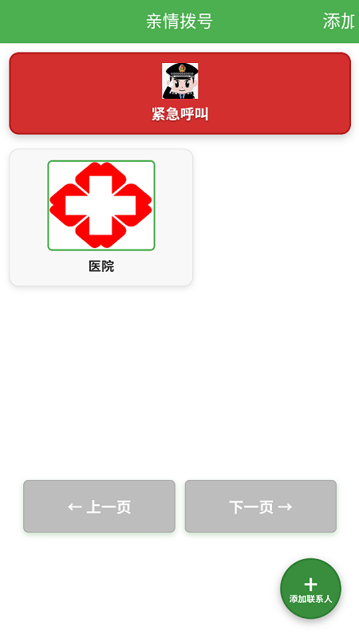
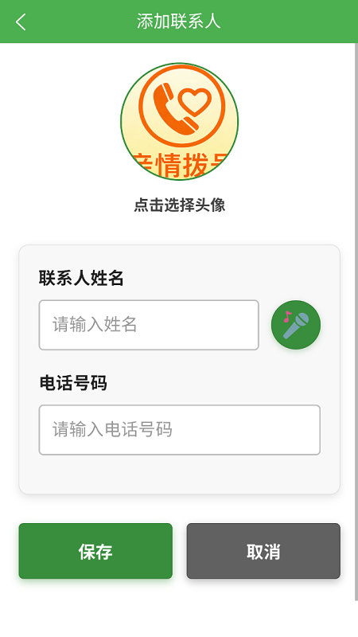
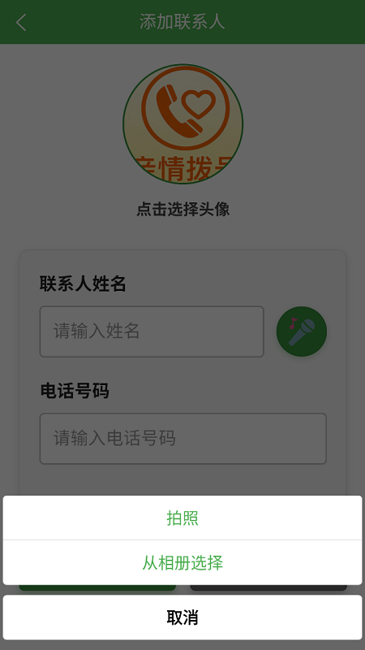
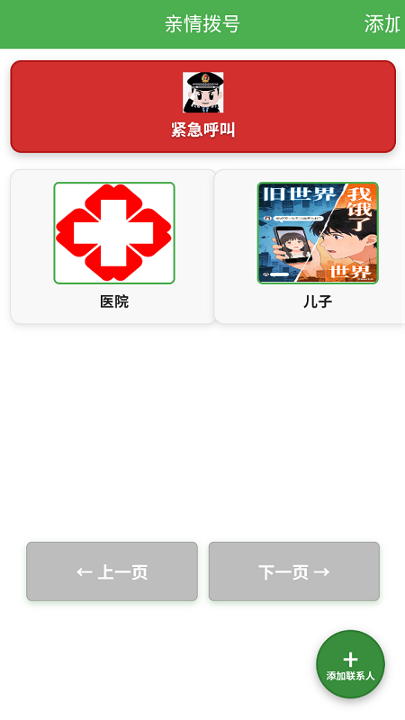

# 亲情拨号 - 适老化拨号应用

## 应用简介

亲情拨号是一款专为文盲老年人群体打造的简单易用拨号应用，通过大图片选择联系人，无需文字输入即可轻松拨打电话。（语音功能没实现）

## 核心功能

- **大图标网格布局**：直观易认，老人可以通过图片快速识别联系人
- **语音提示引导**：操作过程中提供语音反馈，帮助老人理解当前操作
- **紧急呼叫功能**：一键触达紧急救援，保障老人安全
- **自定义联系人头像**：支持拍照或从相册选择头像，个性化管理联系人
- **本地存储数据**：无需网络连接，数据安全可靠
- **分页浏览**：方便查看更多联系人，操作简单直观

## 适老化设计

- **高对比度界面**：清晰易辨，减少视觉疲劳
- **大字体显示**：避免视力困扰，提高可读性
- **简单操作流程**：减少学习成本，降低使用难度
- **语音辅助**：通过语音提示引导操作，无需阅读文字
- **一键操作**：重要功能一键触达，减少操作步骤

## 使用说明

1. **添加联系人**：点击右下角的"+"按钮，进入添加联系人页面
2. **选择头像**：点击头像区域，可以选择拍照或从相册选择图片
3. **输入信息**：填写联系人姓名和电话号码
4. **保存联系人**：点击保存按钮，联系人会自动添加到主界面
5. **拨打电话**：点击联系人头像，确认后即可拨打电话
6. **删除联系人**：长按联系人头像，确认后即可删除
7. **分页浏览**：使用底部的上一页/下一页按钮查看更多联系人

## 技术特点

- **响应式设计**：适配不同屏幕尺寸，在各种设备上都能良好显示
- **本地数据存储**：联系人数据保存在本地，无需网络连接
- **权限精简**：只请求必要的权限，保护用户隐私
- **离线运行**：完全离线运行，适合无网络环境使用

## 结语

亲情拨号致力于为老年人群体提供简单、安全、易用的拨号解决方案，让科技服务老年人，让亲情沟通更简单。

## 界面展示

### 主界面

### 紧急呼叫

### 联系人详情

### 添加联系人

### 分页功能

